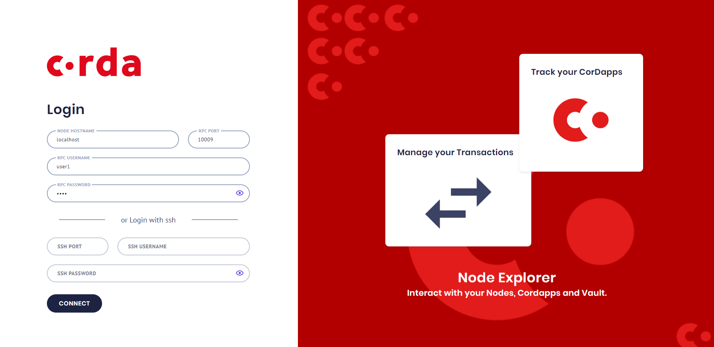
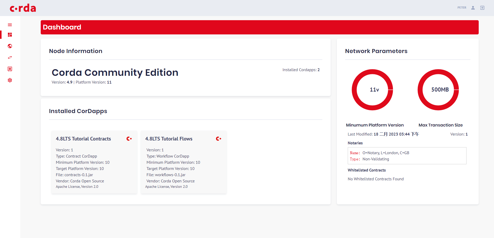
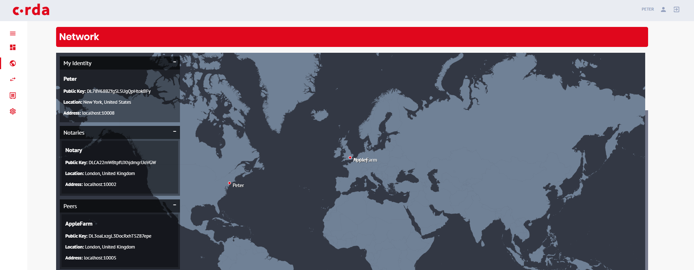

# corda-node-explorer
To visualize the corda node info, refer below, and simplify some steps.

https://github.com/corda/node-explorer

## node-server
1. ./gradlew.bat clean build
2. java -jar .\build\libs\explorer-server-0.1.0.jar

## node-explorer
compared https://github.com/corda/node-explorer, change package.json and Transaction.scss

Why change? install cause error in Windows.

```
// if Windows, please run in git bash, as npm start have cp cmd
npm install
npm start
```

## sample corda nodes
https://github.com/corda/samples-java/tree/master/Basic/tutorial-applestamp
```
cd samples-java/Basic/tutorial-applestamp
./gradlew clean build deployNodes -x test
./build/nodes/runnodes.bat
```

## Screenshot

sample corda node rpc info in Basic/tutorial-applestamp/build/nodes/Peter/node.conf

each node can connect.





